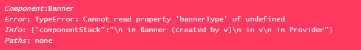

# error-boundary

An Error Boundary HOC for React Projects



## Installation
```bash
npm i -S @react-nitro/error-boundary
```

## Documentation

#### HOC
A higher-order component (HOC) is an advanced technique in React for reusing component logic. HOCs are not part of the React API, per se. They are a pattern that emerges from React’s compositional nature.

For more information on creating HOC's, checkout [HOC-React](https://reactjs.org/docs/higher-order-components.html).

#### Error Boundary
A JavaScript error in a part of the UI shouldn’t break the whole app. To solve this problem for React users, React 16 introduces a new concept of an “error boundary”.

For more information on creating error boundaries, checkout [Error Boundary React](https://reactjs.org/docs/error-boundaries.html).

## Usage
```js
// Banner Component 
import React from 'react';
import ReactDOM from 'react-dom';
...
import { withErrorBoundary } from '@react-nitro/error-boundary';

class Banner extends React.PureComponent {
  render() {
    /* istanbul ignore next */
    const {
      cms: { bannerType }
    } = this.props;
    /* istanbul ignore else if */
    if (bannerType === BANNER_TYPE_SITE) {
      return <SiteBanner {...this.props} />;
    } else if (bannerType === BANNER_TYPE_PAGE) {
      return <PageBanner {...this.props} />;
    }
    /* istanbul ignore next */
    return <div />;
  }
}

Banner.propTypes = {
  cms: PropTypes.object.isRequired
};

const BannerWrapped = withErrorBoundary(Banner, null, 'Banner');

export default BannerWrapped;
```

## API
`withErrorBoundary(WrappedComponent, paths, [comonentName])`

Arguments
* __WrappedComponent (Object)__: The React component to be wrapped by the HOC.
* __path (Array|string)__: The path(s) of the properties to test from `this.props`.
* __[comonentName] (string)__: The name of the component to be shown in the error.

```js
// Banner Component

const BannerWrapped = withErrorBoundary(Banner, ['a.b', 'a.c[0]', 'd.e.f.g'], 'Banner');
```


## Utils
This package comes with two addtional utilities

1. `get(object, path, [defaultValue])`

 Wrapper over [lodash.get](https://lodash.com/docs/4.17.10#get) to have fallbacks for deep objects paths. Also throws errors in the console for paths that were not reachable without causing problems in execution.

Arguments
* __object (Object)__: The object to query.
* __path (Array|string)__: The path of the property to get.
* __[defaultValue] (*)__: The value returned for undefined resolved values.
```js
// Example usage
...
import { get } from '@react-nitro/error-boundary';
...
class TextComp extends PureComponent {
    render() {
        return (<div>{get(this.props, 'a.b.c[0].d', 'fallback')}</div>)
    }
}
```

2. `Storage`

Static class to do the read/write to session storage, reading/writing cookies etc.

```js
import { Storage } from '@react-nitro/error-boundary';
/**
 * This function sets the data to session storage per the key provided
 * @param {String} key The key to set into session storage
 * @param {Object} value The value to be set against the key in session storage
 */
Storage.setSessionStorage('foo', 'bar');
/**
 * This function gets the value/data from session storage based on the key provided.
 * @param {String} key The key identifier to get data from session storage
 */
Storage.getSessionStorage('foo');
/**
 * This function removes the session storage key and its data
 * @param {String} key The key identifier to remove data from session storage
 */
Storage.removeSessionStorage('foo');
/**
 * This function is able to get the cookie data based on the cookie name provided.
 * If the cookie name not found, it will return blank string.
 * @param {*} cName
 */
 Storage.getCookie('foo');
 /**
 * This function to set a cookie
 * @param {String} key 
 * @param {String} value 
 * @param {String} expiry 
 */
 Storage.setCookie('foo', 'bar');
```

